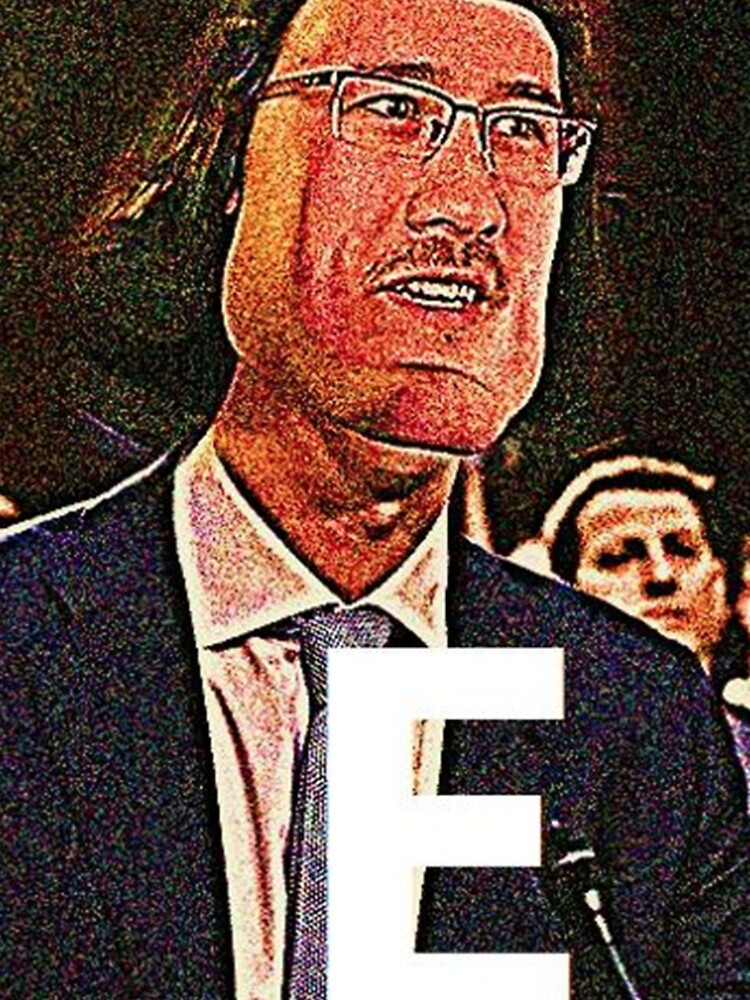

```{r setup, include=FALSE}
knitr::opts_chunk$set(echo=TRUE, message=FALSE, warning=FALSE, error=FALSE)
```

```{css}
body{
background-color: #001D2D;
color: white;
}
h2{
color: pink;
}
```

## Project requirements
<br>
**[https://github.com/Polkez/stats220](https://github.com/Polkez/stats220)**

## Inspo meme
 <br>

The Key Components are:

* The noise in the image
* The heavily edited image as well
* The letter at the bottom of the image
* The photoshopped face on the the image of Mark Zuckerberg

## My meme
 <br>
The differences are:

* The photoshopped face, might make the project a tad more complex so I did not do it.
* I did not edit it that much compared to the previous image, as it would make it more complex as well.

## My animated meme
<br>

A gif of Hbomber guy turning red

## Creativity
I used more functions in the magick library to create the effect I wanted on the image I have chosen. The 3 functions used are; image_noise, image_modulate and image_contrast, so that the meme is similar to the inspired meme.

I also made the HTML readable in the dark and nicer to everyone's eye

## Learning reflection
The most important thing I learned is making your code readable and commenting on your code. So that people reading your code can understand it quickly and easily without rereading it too much.

Having tabs, whitespaces, commenting, and proper indenting requirements in this project helped me understand the importance of readable code.

The technology I am the most curious about is web scraping, how people actually do it, and the right way to do it without interrupting the websites or the thing you are scrapping. Anything related to how you get data from the internet that does not have proper APIs to get said data would be interesting to learn.


## Appendix

<mark>Do not change, edit, or remove the `R` chunk included below.</mark>

If you are working within RStudio and within your Project1 RStudio project (check the top right-hand corner says "Project1"), then the code from the `meme.R` script will be displayed below.

This code needs to be visible for your project to be marked appropriately, as some of the criteria are based on this code being submitted.

```{r file='meme.R', eval=FALSE, echo=TRUE}

```
