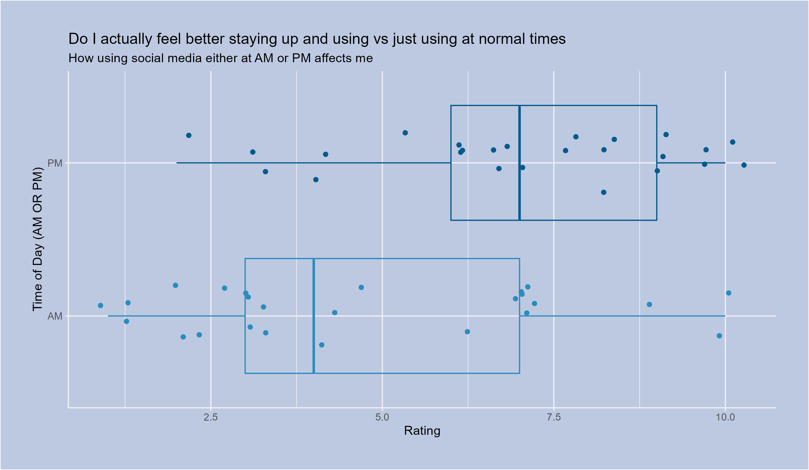
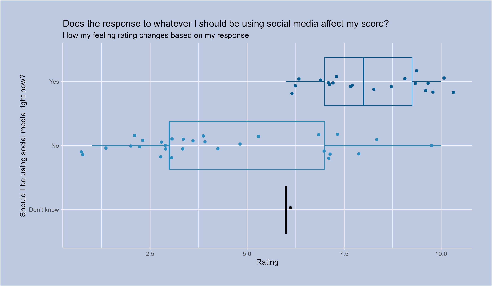

<script src="https://code.jquery.com/jquery-3.7.1.min.js" integrity="sha256-/JqT3SQfawRcv/BIHPThkBvs0OEvtFFmqPF/lYI/Cxo=" crossorigin="anonymous"></script>

```{r setup, include=FALSE}
knitr::opts_chunk$set(echo=FALSE, message=FALSE, warning=FALSE, error=FALSE)
```

```{js}
$(function() {
  $(".level2").css('visibility', 'hidden');
  $(".level2").first().css('visibility', 'visible');
  $(".container-fluid").height($(".container-fluid").height() + 300);
  $(window).on('scroll', function() {
    $('h2').each(function() {
      var h2Top = $(this).offset().top - $(window).scrollTop();
      var windowHeight = $(window).height();
      if (h2Top >= 0 && h2Top <= windowHeight / 2) {
        $(this).parent('div').css('visibility', 'visible');
      } else if (h2Top > windowHeight / 2) {
        $(this).parent('div').css('visibility', 'hidden');
      }
    });
  });
})
```

```{css}
.figcaption {display: none}

body{
background-color: #001D2D;
color: white;
}
h2{
color: pink;
}
h3{
color: lightyellow;
}

```


## How do I actually feel about my social media usage?

I mainly made this observational survey to explore how I feel about social media usage versus how I think I feel.

**I want to explore three questions**:

* When do I use social media
* Does the time of day affect my rating? (based on AM vs PM)
* Are the ratings different if I know whether or not I should be using social media?

**What I think the answers will be**:

* Probably after midnight
* Probably yes
* Yes

Exploring these three questions will give me insight into how I feel about social media.


## When do I use social media?
The first part we explore is whether I am using social media at healthy times (not late at night)


## First plot of the day


### The answer is, I don't use social media at healthy times
The graph above makes it very noticeable when I open a social media app and start doom scrolling. Most often after midnight, you can see my social media opening consistency between 12 AM and 6 AM.

Seeing this makes me want to stop/reduce my use of social media, mainly after midnight.

## Does the time of day affect my rating? (based on AM vs PM)
Do I feel good using social media in the AMS vs the PMS?


## Second Plot: Electric Boogaloo



### Surprise, I am unhappy when using social media at night.
I expected this because I became much more aware when I started logging data about my social media phone usage.

So, reducing my use of social media at night is still necessary.

## Are the ratings different if I know whether or not I should be using social media?
Yeah, I feel like the answer to this question is obvious, but exploring the data is better than how I think I'll feel.


## Third Plot: Threequel :)



### Yeah, I rate way lower when I should not be using social media.
That is a straightforward answer since the rating median is way lower for the No group than the Yes group.

# Conclusion
The story's theme here is that social media is terrible for me, especially when I use it after midnight. I rate lower when it is time in the morning (or after midnight), and when I should not use social media.

So, the data here confirms what I thought the answers were before, and seeing this makes me more aware of how I use social media and when I should use it. 


