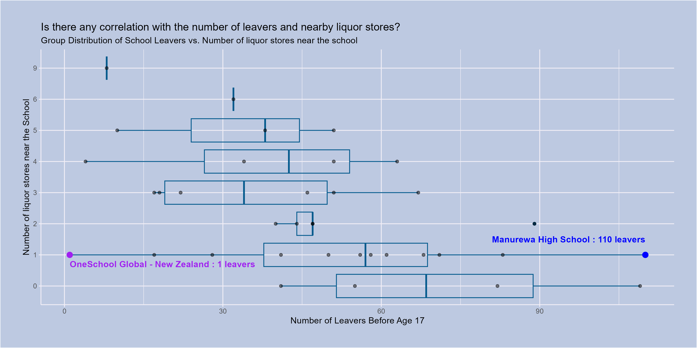

```{css}
body{
background-color: #001D2D;
color: white;
}
h2{
color: pink;
}
h3{
color: lightyellow;
}
```

## Introduction

Describe what schools you decided to focus on for your project, explaining your reference set of schools.

Explain why you decided to focus on these schools, referring to Part A of the project.

Briefly summarize whether scraping data from your high school’s website would be responsible, based on Part B considerations.

Write at least 100 words for this section.

## Visualisation

Describe the main purpose of your visualisation.

Include the image using markdown:



Test

## Creativity

Describe and justify how your visualisation demonstrates creativity.

Write at least 50 words for this section.

## Learning Reflection

Describe at least one important idea learned from Module 5: Creating data from digital sources.

Discuss aspects of data technologies that you are curious about exploring further.

Write at least 100 words for this section.

## Self Review

Reflect on the five projects and refer to at least one course learning outcome for STATS 220.

Summarise two key skills developed by completing the projects.

Write at least 100 words for this section.

## Appendix

Include the contents of your data_sources.R and visualisation.R files:

### data_sources.R
```{r file='data_sources.R', eval=FALSE, echo=TRUE}
```

### visualisation.R
```{r file='visualisation.R', eval=FALSE, echo=TRUE}
```

