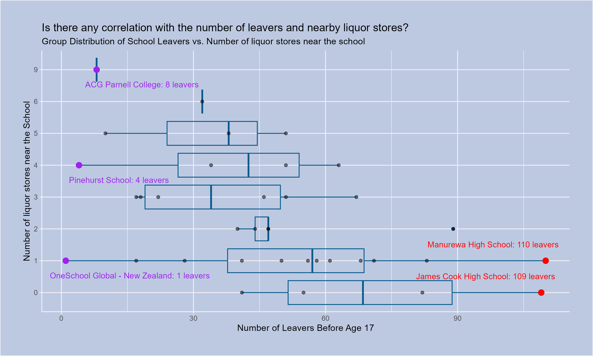

```{css}
body{
background-color: #001D2D;
color: white;
}
h2{
color: pink;
}
h3{
color: lightyellow;
}
```

## Introduction
### Reference Set of Schools
I wanted to focus on schools with a population above or at 1000 students, are based in Auckland, and are co-educational (schools open to boys and girls).

### Reasons for selecting this reference set of school
Three reasons why I picked this reference set of school:
* I wanted to focus on this group because it was local (Auckland). 
* I wanted to be inclusive to both male and female students.
* I tried to pick a student population higher than 1000 to ensure that liquor stores exist in these areas. I assumed that a higher student count meant more liquor stores.

# Webscraping Responsibilities
Even when there are no terms and services and a pretty permissive robot.txt, it would be fine to scrape my high school's website, but not to a point where you are scraping the whole website and causing connectivity issues.

## Visualisation

### Main Purpose
The primary purpose of the visualization I have created is to see if there is any correlation between the number of school leavers and the number of liquor stores near a school.

### The Graph I have created


I was surprised by this result; I expected exactly the opposite of what was shown; the correlation is negative; the more liquor stores there are, the fewer school leavers there are in my reference school set.

## Creativity

I wanted to see if there was any correlation between leavers. Still, the data set that was gathered during the previous parts did not contain the data I wanted, so I copied and pasted the code for the financial data and replaced it with scrape for the leaver's data for all schools.

It demonstrates creativity because I wanted to see if there are trends between the number of nearby liquor stores and the number of leavers.
Describe and justify how your visualization demonstrates creativity.

## Learning Reflection

The most crucial idea learned in data scraping is being responsible for how you scrap websites. We can scrap data responsibly by ensuring you follow procedures such as checking terms and services, robots.txt, and even asking for permission. If we don't, we might cause issues with websites we are about to scrap.

Since I've been asking for data scraping for a while and we have learned it, I am curious about how you store data without using external services such as Google Sheets or the equivalent. At a cursory glance, it's using database servers such as SQL, MariaDB and other such databases, and it makes me very curious about how you set up the pipelines between making the server > and connecting to it using RStudio.

## Self Review

I would say the most critical learning outcome for this course is :
"Demonstrate understanding of programming concepts and skills associated with importing, wrangling and visualizing data for decision making, using R."

I learned two valuable skills when we consider this learning outcome:

1. The first skill is being able to manipulate data, which we have done in most of the projects in some form, and it made me very comfortable in knowing how to get data I want or need from a dataset, either by creating new data or manipulating data frames and more.
2. The second skill is being creative about how we want to visualize a dataset. Going from what's in my mind and creating a visualization of what I wanted to do is way easier now than at the beginning of the course. As Project 4 and Project 5 were plot-heavy, these projects gave me the confidence and practice to create a visualization that matched what I wanted.

These projects helped me develop skills related to data manipulation and visualization.

## Appendix

### data_sources.R
```{r file='data_sources.R', eval=FALSE, echo=TRUE}
```

### visualisation.R
```{r file='visualisation.R', eval=FALSE, echo=TRUE}
```

